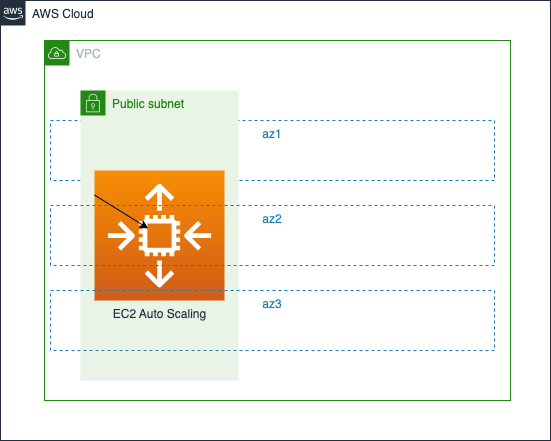

# Auto Scaling Group

This is a boilerplate repo for aws auto scaling group

## Solution Overview



## Prerequisites

### Setup Environment

* [Set Up Your AWS Account]()
* [Install AWS CLI](https://docs.aws.amazon.com/cli/latest/userguide/getting-started-install.html)
* [Install AWS SAM CLI](https://docs.aws.amazon.com/serverless-application-model/latest/developerguide/install-sam-cli.html)

### Setup Credentials

```bash
export AWS_ACCESS_KEY_ID=""
export AWS_SECRET_ACCESS_KEY=""
export AWS_SESSION_TOKEN=""
aws sts get-caller-identity
```

## Dependency

* [Enterprise Network]

## Deploy 

### Local

```bash
aws sts get-caller-identity
sam build && sam deploy --guided
```
